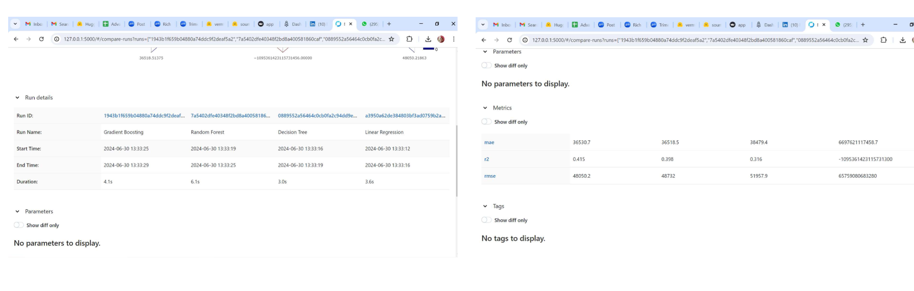

# HR Analytics - Advance Data Engineering Platform in Cloud

## Contributor
- Soumalya Mondal (G23AI1042)
- Joel Paul(G23AI1017)
- under the guidance of Prof. Pradip Sasmal

## Assignment
- Please refer assignment specific README files here.
   - Assignment 1 (Architecture Design and Setup) : [README.md](https://github.com/soumalyamondal-iitj/dataanalytics_aws/blob/main/assignment/1/README.md)
   - Assignment 2 (Data Ingestion and Processing) : [README.md](https://github.com/soumalyamondal-iitj/dataanalytics_aws/blob/main/assignment/2/README.md)
   - Assignment 3 (Data Aggregation and Visualization) : [README.md](https://github.com/soumalyamondal-iitj/dataanalytics_aws/blob/main/assignment/3/README.md)

## Table of Contents
- Overview
- Background
- Requirement
- Architecture Overview
- Implementation
- Demonstrattion of functionality
- Key features
- Retention policy and lifecycle management
- Security best practices
- Cost optimization
- Challenges encountered
- Lessons learned

## Overview
Predicting employee salaries is essential for HR departments to ensure fair compensation practices, effective budget planning, and enhanced employee satisfaction. This project showcases the design and implementation of a comprehensive data engineering platform for analyzing streaming data from the HR department. The platform integrates multiple components for data ingestion, storage, processing, aggregation, and visualization, providing real-time insights and supporting data-driven decision-making.

## Background
This repository contains the code and configuration files for a
scalable data engineering platform built using AWS services to develop the .
In modern data-driven organizations, the ability to efficiently
ingest, store, process, aggregate, and visualize large volumes of data
is critical. This project aims to design and implement a scalable data
engineering platform using AWS services to handle data sizes ranging
from 10MB to 100GB. The platform will enable real-time data ingestion,
scalable data storage, efficient data processing, and insightful data
visualization.

## Requirement
Design the high-level architecture of the data engineering platform, including the following components:
   - Data Ingestion
   - Data Storage
   - Data Processing
   - Data Aggregation
   - Data Visualization

## Architecture Overview

### Design Components
#### Data Ingestion
- AWS Kinesis Data Streams: Used for real-time data ingestion from
various sources.
- AWS Firehose: Buffers and batches incoming data before storing it in AWS S3.

#### Data Storage
- AWS S3: Provides durable and scalable storage for raw and processed data.

#### Data Processing
- AWS Glue: A managed ETL service that processes and transforms data
stored in S3.

#### Data Aggregation
- AWS Redshift: A data warehouse that aggregates processed data for
fast querying and analysis.

#### Data Visualization
- AWS QuickSight: A BI service that provides interactive dashboards
and visualizations of aggregated data.

## Implementation
### Repository Structure - Code samples, scripts, and configuration files

- `ingestion/`: Code and configurations for data ingestion.
- `storage/`: S3 bucket configurations.
- `processing/`: AWS Glue job scripts.
- `aggregation/`: Redshift configurations and queries.
- `visualization/`: QuickSight dashboard configurations.

## Directory Structure

### Setup Instructions

#### Set up AWS Kinesis Data Streams and AWS Firehose for data ingestion.

- Refer the kinesis_stream_configuration.json and setup the AWS Kinesis Data Streams as below:

- Refer the firehose_stream_configuration.json and setup the AWS Kinesis Data Streams as below:

2. Configure an S3 bucket for raw data storage as files.

- Refer the s3_bucket_acl.json, s3_bucket_location.json and  s3_bucket_policy.json and setup the AWS S3 bucket as below:

3. Set up AWS Glue for data processing, including creating Glue jobs for ETL 
    to trasform data from S3 to Redshift tables after processing cleaning.

- Refer the aws-glue-job-ade.py and setup the AWS Glue with Spark as below:

4. Configure AWS Redshift for data aggregation and create necessary tables.

- Refer the redshift_cluster_properties.json and employee_info.sql and setup the AWS Redshift as below:

- Redshift Editor

5. Set up AWS QuickSight for data visualization and create sample dashboards.
- Create an account in AWS Quicksight
- Select datasource as Redshift and select the Redshift clustername to load the data

## Model Development and Deployment
- Please refer the https://github.com/soumalyamondal-iitj/dataanalytics_aws/edit/main/SalaryAnalytics.py for the model implementation. We evaluated LinearRegression, DecisionTreeRegressor, RandomForestRegressor models and based on the RMSE values, RandomForest is determined as best fit model
- This model uses data from S3 which is stored through the data streaming
- Model is registered in MLFlow to track and log all the details of your machine learning experiments, including parameters, metrics, artifacts (such as models), and source code.

  ### Model Architecture and Deployment digaram:
  
  

  ### MLFlow - Tracking of model parameters
  

  
  ### Deployment in Huggingface
  Public URL for model: https://huggingface.co/spaces/soumalya-iitj/HRAnalytics_PredictSalary
  

## Demonstrattion of Data Visualization 

- [HR Analytics Visualization-QuickSight](./visualization/HRAnalytics-Visualization-QuickSight.pdf)
  

## Key Features
### Data Storage
- Scalable Storage**:
  - AWS S3 for storing raw and processed data.

### Data Processing
- ETL (Extract, Transform, Load)**:
  - AWS Glue for data transformation and processing.
  - Glue jobs for cleaning and enriching data.

### Data Aggregation
- Data Warehousing**:
  - AWS Redshift for data aggregation and fast querying.
  - Optimized queries for performance.

### Data Visualization
- Business Intelligence:
  - AWS QuickSight for interactive dashboards and visualizations.

## Retention policy
- Data retention policies can be enforced through a combination of S3 bucket policies, access control lists (ACLs), and object lock features.
- S3 Object Lock
   Object Lock: Prevents an object from being deleted or overwritten for a specified retention period.
   Retention Modes:
      Compliance Mode: Ensures an object cannot be overwritten or deleted by any user, including the root user, during the retention period.
      Governance Mode: Protects objects against being overwritten or deleted by most users, but some users (e.g., root user) can alter the retention settings.

  - Code:
    
      s3 = boto3.client('s3')
      
      bucket_name = 's3-kinesis-etl-bucket-ade'
      object_key = 'HR Dataset.csv'
      retention_period_days = 30
      
      s3.put_object_retention(
          Bucket=bucket_name,
          Key=object_key,
          Retention={
              'Mode': 'GOVERNANCE',
              'RetainUntilDate': (datetime.datetime.now() + datetime.timedelta(days=retention_period_days)).isoformat()
          }
      )

## Security best practices

   ### Bucket Policies and IAM Policies
      - Least Privilege Principle: Grant the minimal level of access necessary for users to perform their tasks.
         Bucket Policies: Use bucket policies to define access at the bucket level.
         IAM Policies: Use IAM policies to manage access at the user or group level.
      - policy:
      
         {
           "Version": "2012-10-17",
           "Statement": [
             {
               "Sid": "AllowOnlyReadAccess",
               "Effect": "Allow",
               "Principal": "*",
               "Action": "s3:GetObject",
               "Resource": "arn:aws:s3:::s3-kinesis-etl-bucket-ade/*"
             }
           ]
         }
   
   ### Enable Server-Side Encryption
   - SSE-S3: Amazon S3 manages the encryption keys.
   - SSE-KMS: AWS Key Management Service (KMS) manages the encryption keys.
   - SSE-C: You manage the encryption keys.
   - Code:
     import boto3
   
      s3 = boto3.client('s3')
      s3.put_bucket_encryption(
          Bucket='s3-kinesis-etl-bucket-ade',
          ServerSideEncryptionConfiguration={
              'Rules': [
                  {
                      'ApplyServerSideEncryptionByDefault': {
                          'SSEAlgorithm': 'AES256'
                      }
                  }
              ]
          }
      )

## Cost optimization
   ### Use Appropriate Storage Classes
   
      - Amazon S3 offers several storage classes designed for different use cases. Choosing the right storage class for your data can significantly reduce costs.
      
      - S3 Standard: For frequently accessed data.
      - S3 Intelligent-Tiering: Automatically moves data between two access tiers when access patterns change, optimizing costs.
      - S3 Standard-IA (Infrequent Access): For data that is accessed less frequently but requires rapid access when needed.
      - S3 One Zone-IA: For infrequently accessed data that does not require multiple Availability Zone resilience.
      - S3 Glacier: For long-term archival with retrieval times ranging from minutes to hours.
      - S3 Glacier Deep Archive: For the lowest-cost storage with retrieval times of 12 hours or more.
   
      - Code:
         import boto3
      
         s3 = boto3.client('s3')
         
         s3.copy_object(
             Bucket='my-bucket',
             CopySource='s3-kinesis-etl-bucket-ade/my-object',
             Key='my-object',
             StorageClass='GLACIER'
         )
      
      ### Implement Lifecycle Policies
      - Lifecycle policies help automate the transition of objects to cheaper storage classes and the expiration (deletion) of objects that are no longer needed.
      - Policy:
       {
        "Rules": [
          {
            "ID": "Move to Glacier and Expire",
            "Status": "Enabled",
            "Filter": {
              "Prefix": ""
            },
            "Transitions": [
              {
                "Days": 30,
                "StorageClass": "GLACIER"
              }
            ],
            "Expiration": {
              "Days": 365
            }
          }
        ]
      }

## Challenges encountered
- Acces issues for resources
    a. Setting correct IAM role for resources
    b. VPC and v-net setting
- Data type mismatch issue during data loading to Redshift
- Ensuring the platform can handle varying data sizes
efficiently.
- Structuring S3 buckets for efficient data management.
- Implementing robust validation and cleansing processes.
- Optimizing Redshift queries for large datasets.

## Lessons learned
- It's crucial to design the data flow to
handle peak loads without data loss.
- Properly configuring buffer sizes and
intervals in Kinesis Firehose can significantly improve performance.
- Structuring S3 data with appropriate
prefixes improves data retrieval efficiency.
- Well-designed Redshift queries are
essential for fast and efficient data aggregation.
- Creating responsive and interactive
dashboards in QuickSight enhances user experience.
- Implementing detailed IAM policies helps
in maintaining secure and controlled access to resources.
- Setting up proper logging and monitoring helps in troubleshooting the issue

